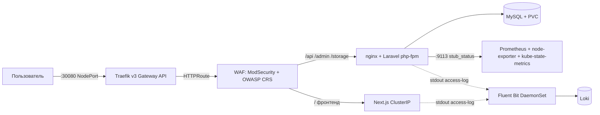

# Документация проекта `full_proj` — индекс спецификаций

Документация ведётся в подходе **spec-driven development**: каждый раздел технического
задания (кейс «MTC ENGINEER HACK», DevOps) отражён в отдельной спецификации
«требования → критерии приёмки → проектные решения → реализация → верификация».
Спецификации — источник истины о том, **что** реализовано, **как** это проверить
и **что** ещё предстоит сделать.

## Карта спецификаций

| № | Спецификация | Раздел кейса | Статус |
|---|---|---|---|
| 01 | [Kubernetes-окружение](specs/01-kubernetes.md) | п.1 | ✅ k3s v1.36.5 + Helm + deploy.sh |
| 02 | [Демонстрационное веб-приложение](specs/02-application.md) | п.2 | ✅ реализовано |
| 03 | [Gateway API](specs/03-gateway-api.md) | п.3 | ✅ Traefik v3.7.13: GatewayClass + Gateway + HTTPRoute |
| 04 | [Мониторинг (Prometheus)](specs/04-monitoring.md) | п.4 | ✅ Prometheus + node-exporter + kube-state-metrics + nginx-exporter |
| 05 | [Логирование (Fluent Bit → Loki)](specs/05-logging.md) | п.5 | ✅ Fluent Bit DaemonSet → Loki |
| 06 | [WAF ModSecurity + OWASP CRS](specs/06-waf.md) | доп. улучшение | ✅ в Compose и в Kubernetes |
| 07 | [Автоматизация развёртывания](specs/07-automation.md) | п.7 | ✅ deploy.sh, идемпотентность проверена |
| 08 | [Безопасность и секреты](specs/08-security.md) | требования безопасности | ✅ реализовано |
| 09 | [Перенос на новый GitHub](specs/09-migration.md) | подготовка к сдаче | ✅ подготовлено |

Полная детальная спецификация WAF — [`waf/SPEC.md`](../waf/SPEC.md).

## Архитектура

**Единая точка входа (вариант A):** весь HTTP-трафик (и фронтенд, и бэкенд) проходит
через Gateway API → WAF. WAF инспектирует ModSecurity+CRS каждый запрос и сам
маршрутизирует по пути: `/api`, `/admin`, `/storage`, `/sanctum`, `/livewire`,
`/filament`, `/css`, `/js`, `/vendor` → бэкенд; всё остальное (включая `/api/contact`)
→ фронтенд. Отдельного внешнего порта у фронтенда нет — обойти WAF нельзя.

Все компоненты — в кластере **k3s v1.36.5** (Ubuntu 24.04.5 LTS),
развёртывание одной командой `./scripts/deploy.sh` (Helm-чарты из OCI ghcr.io).

## Матрица трассируемости требований кейса

| Требование кейса | Статус | Где проверять |
|---|---|---|
| веб-приложение в Kubernetes | ✅ | [SPEC-01](specs/01-kubernetes.md), [SPEC-02](specs/02-application.md) |
| доступ через Kubernetes Gateway API | ✅ | [SPEC-03](specs/03-gateway-api.md) — `curl http://localhost:30080/api/news` |
| Prometheus собирает метрики | ✅ | [SPEC-04](specs/04-monitoring.md) — `up`, `nginx_http_requests_total` |
| Fluent Bit собирает логи | ✅ | [SPEC-05](specs/05-logging.md) — Loki API после запроса |
| Ubuntu 24.04 | ✅ | [SPEC-01](specs/01-kubernetes.md), [SPEC-07](specs/07-automation.md) |
| автоматизация, воспроизводимость, идемпотентность | ✅ | [SPEC-07](specs/07-automation.md) |
| README + паспорт решения | ✅ | [README](../readme.md), [passport.md](passport.md) |
| нет секретов в репозитории | ✅ | [SPEC-08](specs/08-security.md) |
| дополнительные улучшения | WAF ✅, метрики приложения ✅, CI/CD ⚠️ финал | [SPEC-06](specs/06-waf.md), [SPEC-04](specs/04-monitoring.md) |
