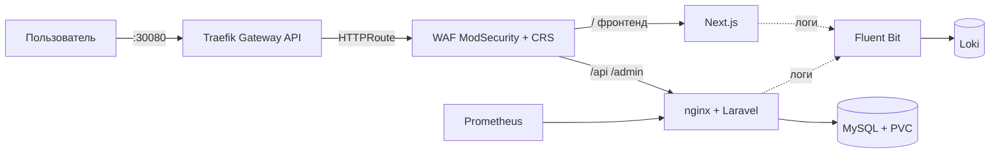

# Паспорт решения — `full_proj`

> Паспорт для быстрого скрининга экспертами (структура по заданию: 3 страницы).
> Подробная документация и спецификации — в репозитории ([`docs/`](README.md)).

---

## Страница 1. Архитектура и состав решения

| Параметр | Значение |
|---|---|
| Версия Kubernetes | **k3s v1.36.5 (Kubernetes v1.36.5)**, containerd 2.3.4 |
| Способ развёртывания K8s | k3s (`get.k3s.io`), всё приложение — Helm-чарты, одна команда `./scripts/deploy.sh` |
| Реализация Gateway API | **Traefik v3.7.13** (Gateway API v1.5.1): GatewayClass `traefik`, Gateway `full-proj-gateway` (PROGRAMMED), HTTPRoute `full-proj-route` |
| Инструменты автоматизации | `scripts/build-images.sh`, `scripts/deploy.sh`, Helm, GitHub Actions (подготовлен) |
| Логирование | **Fluent Bit v5.1.3 (DaemonSet) → Loki v3.6.12** (filesystem + PVC) |
| Prometheus | **Prometheus v3.15** + node-exporter + kube-state-metrics + nginx-exporter приложения |
| ОС тестирования | Ubuntu 24.04.5 LTS |
| Доп. улучшения | **WAF ModSecurity + OWASP CRS** (✅ в k8s и Compose), метрики приложения (✅), безопасность секретов (✅) |

### Архитектурная схема

---

## Страница 2. Реализованный функционал

### Обязательная часть

| Требование кейса | Как реализовано | Обоснование | Как проверить |
|---|---|---|---|
| Веб-приложение в Kubernetes | Deployments backend(+nginx+exporter)/frontend/mysql, PVC, Secret `app-secrets`, миграции | стандартные ресурсы, минимальный стек | `kubectl get pods -n full-proj`; `curl localhost:30080/api/news` → 200 JSON |
| Доступ через Gateway API | Traefik v3: GatewayClass + Gateway (:80) + HTTPRoute → Service waf | open-source, без вендор-лока; Gateway API v1.5.1 | `kubectl get gateway -n full-proj` (PROGRAMMED=True); `curl -s localhost:30080/api/news` |
| Prometheus собирает метрики | prometheus-чарт + node-exporter + kube-state-metrics + sidecar nginx-exporter (аннотации) | метрики и инфраструктуры, и приложения | `kubectl port-forward -n monitoring svc/prometheus-server 9090:80`; `curl localhost:9090/api/v1/query?query=up`; `nginx_http_requests_total` |
| Fluent Bit собирает логи | DaemonSet Fluent Bit (CRI-парсер) → Loki single-binary | лёгкий сборщик, централизованное хранилище | после `curl` к приложению: Loki API `{namespace="full-proj"}` содержит access-лог |
| Ubuntu 24.04 | весь стенд развёрнут на Ubuntu 24.04.5 LTS | требование кейса | воспроизведение по `deploy.sh` |
| Автоматизация | `deploy.sh` (5 шагов, Helm из OCI); повторный запуск идемпотентен | минимум команд, воспроизводимость | `./scripts/deploy.sh` повторно → «has been upgraded», без ошибок |

### Дополнительные улучшения

| Улучшение | Как реализовано | Обоснование | Как проверить |
|---|---|---|---|
| WAF в k8s | Deployment `waf` (ModSecurity+CRS) — **единая точка входа: фронтенд и бэкенд за WAF** (роутинг по path); правило 1000001 (сканеры/ботнеты), `limit_req` на статику (429); ConfigMap'ы в `helm/templates/waf.yaml` | защита прикладного уровня, обойти нельзя (внешних портов у приложений нет) | `./waf/tests/run-tests.sh http://localhost:30080` → **18/18**; `python3 waf/tests/ddos_static.py` → 429; `kubectl logs deploy/waf` → audit JSON с ruleId |
| Метрики приложения | nginx-prometheus-exporter sidecar (stub_status) | HTTP-метрики обязательны для observability | PromQL `nginx_http_requests_total` растёт после запросов |
| Безопасность секретов | env/Secret/CI-secrets; история очищена от утёкших секретов | требование кейса | SPEC-08: git grep по истории пусто |
| CI/CD | workflow GH Actions (build → GHCR → helm deploy) подготовлен | финал — на завершающем этапе | push в main → pipeline |

---

## Страница 3. Ревью работы и потенциальное масштабирование

**Главная особенность решения.** Полный набор обязательных пунктов кейса в едином
контуре k3s: Gateway API (Traefik) как единственная точка входа, WAF ModSecurity
перед приложением, метрики приложения и узла в Prometheus, логи в Loki — всё
воспроизводится одной командой из чистого репозитория.

**Самое сложное решение.** Реализация частотного ограничения (L7-DDoS): коллекции
ModSecurity v3 не персистятся между запросами (проверено экспериментально), поэтому
правило сделано на nginx `limit_req` (ADR-4 в `waf/SPEC.md`); плюс отладка DNS k3s
v1.36.x (CoreDNS без env service host/port + конфликт CIDR сервисов с маршрутами VPN —
зафиксировано в SPEC-01).

**Предложения по дальнейшему развитию:**

1. kubeadm-кластер (приоритет кейса) + HA (≥3 узла, внешний etcd).
2. TLS: cert-manager + HTTPS-listener в Gateway.
3. Расширенный Gateway API: маршрутизация по path/hostname, несколько бэкендов, traffic splitting.
4. Grafana-дашборды (Node Exporter Full, nginx, Loki datasource) + алерты.
5. Security-контур: gitleaks в CI, sealed-secrets, NetworkPolicy, RBAC.
6. Телком-специфика: HPA по метрикам, геораспределённость, HA БД (репликация/бэкапы,
   S3-совместимое хранилище логов) — потребует внешней инфраструктуры оператора.
