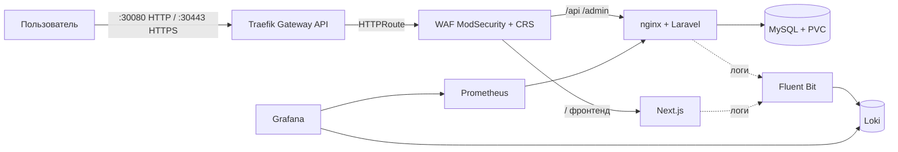

# Паспорт решения — `full_proj`

> Паспорт для быстрого скрининга экспертами (структура по заданию: 3 страницы).
> Подробная документация и спецификации — в репозитории ([`docs/`](README.md)).

---

## Страница 1. Архитектура и состав решения

| Параметр | Значение |
|---|---|
| Версия Kubernetes | **k3s v1.36.5 (Kubernetes v1.36.5)**, containerd 2.3.4 |
| Способ развёртывания K8s | k3s (`get.k3s.io`), всё приложение — Helm-чарты, одна команда `./scripts/deploy.sh` |
| Реализация Gateway API | **Traefik v3.7.13** (Gateway API v1.5.1): GatewayClass `traefik`, Gateway `full-proj-gateway` (listeners HTTP :80 + HTTPS :443, PROGRAMMED), HTTPRoute `full-proj-route` |
| Внешний доступ | HTTP `http://<node-ip>:30080`, HTTPS `https://<node-ip>:30443` (самоподписанный TLS, terminate на Gateway) |
| Инструменты автоматизации | `scripts/build-images.sh`, `scripts/deploy.sh`, `scripts/gen-cert.sh`, Helm, GitHub Actions (CI + CD) |
| Логирование | **Fluent Bit v5.1.3 (DaemonSet) → Loki v3.6.12** (filesystem + PVC) |
| Мониторинг | **Prometheus v3.15** + node-exporter + kube-state-metrics + nginx-exporter приложения |
| Визуализация | **Grafana v12.3.1** (NodePort 30300): 4 дашборда (железо, k8s/приложение, WAF-логи, **живость сервисов**), Prometheus + Loki подключены автоматически |
| ОС тестирования | Ubuntu 24.04.5 LTS |
| Доп. улучшения | **WAF ModSecurity + OWASP CRS** (в k8s и Compose), метрики приложения, Grafana, HTTPS/самоподписанный TLS |

### Архитектурная схема



---

## Запуск (привет проверяющему!)

Инструкция — в [README](../readme.md), раздел «Быстрый старт». Минимальный путь:

```bash
# 0. Кластер k3s (один раз; Ubuntu 24.04)
curl -sfL https://get.k3s.io | sh -s - --disable traefik --disable metrics-server
sudo cat /etc/rancher/k3s/k3s.yaml > ~/.kube/config && chmod 600 ~/.kube/config

# 1. Образы приложения в локальный registry
./scripts/build-images.sh

# 2. Секреты: свой файл + пароль Grafana
cp local-secrets.example.yaml local-secrets.yaml
#    APP_KEY — сгенерировать командой (выводится готовый ключ, скопировать в файл):
#      echo "base64:$(openssl rand -base64 32)"          # проще всего
#    DB_PASSWORD / DB_ROOT_PASSWORD — любые свои значения
export GRAFANA_ADMIN_PASSWORD=...                  # пароль Grafana (обязателен)

# 3. Развернуть ВСЁ одной командой:
#    Gateway API (HTTP+HTTPS) → WAF → приложение, Prometheus, Grafana,
#    Loki+Fluent Bit, Argo CD (GitOps)
./scripts/deploy.sh
```

Пароли в репозитории не хранятся — генерируются при развёртывании:
`APP_KEY` — командой выше (готовый ключ копируется в `local-secrets.yaml`;
одноразовый `docker run` — просто генератор строки, образ в кластер не
попадает); Argo CD — автоматически (извлечение ниже); Grafana — из
`GRAFANA_ADMIN_PASSWORD`; пользователь CMS — интерактивно.

```bash
kubectl -n argocd get secret argocd-initial-admin-secret -o jsonpath='{.data.password}' | base64 -d   # Argo CD
kubectl exec -it -n full-proj deploy/backend -c backend -- php artisan make:filament-user              # CMS
```

Точки входа после развёртывания:

| Сервис | URL | Доступ |
|---|---|---|
| Приложение (фронтенд) | `https://<node-ip>:30443/` | открытый; `http://<node-ip>:30080/` → 302-редирект на HTTPS |
| Приложение (HTTPS, самоподписанный TLS) | `https://<node-ip>:30443/` | предупреждение браузера о CA — ожидаемо |
| Админ-панель Filament | `https://<node-ip>:30443/admin` | пользователь создаётся в CMS |
| API | `https://<node-ip>:30443/api` | JSON |
| Grafana | `http://<node-ip>:30300` | `admin` / пароль из `GRAFANA_ADMIN_PASSWORD` (задаётся при развёртывании) |
| Prometheus | `kubectl port-forward -n monitoring svc/prometheus-server 9090:80` | `http://localhost:9090` |
| Loki | `kubectl port-forward -n logging svc/loki 3100:3100` | `http://localhost:3100` |

---

## Страница 2. Реализованный функционал

### Обязательная часть

| Требование кейса | Как реализовано | Обоснование | Как проверить |
|---|---|---|---|
| Веб-приложение в Kubernetes | Deployments backend(+nginx+exporter)/frontend/mysql, PVC, Secret `app-secrets`, миграции | стандартные ресурсы, минимальный стек | `kubectl get pods -n full-proj`; `curl localhost:30080/api/news` → 200 JSON |
| Доступ через Gateway API | Traefik v3: GatewayClass + Gateway (HTTP :80 → 302-редирект, HTTPS :443) + HTTPRoute → Service waf | open-source, без вендор-лока; Gateway API v1.5.1 | `kubectl get gateway -n full-proj` (PROGRAMMED=True); `curl -sk https://localhost:30443/api/news` → 200 |
| Prometheus собирает метрики | prometheus-чарт + node-exporter + kube-state-metrics + sidecar nginx-exporter (аннотации) | метрики и инфраструктуры, и приложения | `kubectl port-forward -n monitoring svc/prometheus-server 9090:80`; `curl localhost:9090/api/v1/query?query=up`; `nginx_http_requests_total` |
| Fluent Bit собирает логи | DaemonSet Fluent Bit (CRI-парсер) → Loki single-binary | лёгкий сборщик, централизованное хранилище | после `curl` к приложению: Loki API `{namespace="full-proj"}` содержит access-лог |
| Ubuntu 24.04 | весь стенд развёрнут на Ubuntu 24.04.5 LTS | требование кейса | воспроизведение по `deploy.sh` |
| Автоматизация | `deploy.sh` (7 шагов, Helm из OCI, Argo CD); повторный запуск идемпотентен | минимум команд, воспроизводимость | `./scripts/deploy.sh` повторно → «has been upgraded», без ошибок |

### Дополнительные улучшения

| Улучшение | Как реализовано | Обоснование | Как проверить |
|---|---|---|---|
| WAF в k8s | Deployment `waf` (ModSecurity+CRS) — **единая точка входа: фронтенд и бэкенд за WAF** (роутинг по path); правило 1000001 (сканеры/ботнеты), `limit_req` на статику (429); ConfigMap'ы в `helm/templates/waf.yaml` | защита прикладного уровня, обойти нельзя (внешних портов у приложений нет) | `./waf/tests/run-tests.sh http://localhost:30080` → **18/18**; `python3 waf/tests/ddos_static.py` → 429; `kubectl logs deploy/waf` → audit JSON с ruleId |
| Метрики приложения | nginx-prometheus-exporter sidecar (stub_status) | HTTP-метрики обязательны для observability | PromQL `nginx_http_requests_total` растёт после запросов |
| CI/CD | CI `.github/workflows/ci.yml` (авто на push/PR): helm lint + сборка + push в GHCR. CD `.github/workflows/deploy.yml` (workflow_dispatch): helm upgrade на self-hosted runner — выполняет принимающая сторона | финал — на завершающем этапе | push в main → CI зелёный, образы в GHCR |
| Grafana | чарт `infra/grafana/values.yaml`, NodePort 30300; Prometheus+Loki подключены автоматически; 4 дашборда из ConfigMap (железо, k8s/приложение, WAF-логи, живость сервисов); пароль админа хранится в PVC (меняется в UI) | визуализация метрик и логов без ручной настройки | `http://<node-ip>:30300` → дашборды с данными, Service Health — все UP |
| HTTPS (самоподписанный TLS) | listener `https` :443 в Gateway (`certificateRefs` → Secret `full-proj-tls` из `scripts/gen-cert.sh`); terminate на Traefik, WAF инспектирует расшифрованный трафик | безопасность без внешнего CA; фронтенд на относительных URL — работает и по HTTP, и по HTTPS | `curl -sk https://localhost:30443/api/news` → 200; атака на HTTPS → 403 |
| DevSecOps: gitleaks | джоба `secrets` в CI (`gitleaks-action`, полная git-история) — блокирует сборку при утечке | превентивная защита от попадания секретов | локально: 79 коммитов — «no leaks found»; CI green |
| DevSecOps: Argo CD (GitOps) | Argo CD (NodePort 30444; пароль — из `argocd-initial-admin-secret`) управляет приложением из ветки `main`; automated sync: selfHeal + prune; секреты вне git (`secrets.existingSecret`); образы по git SHA, WAF по диджесту | кластер всегда = репозиторий, ручной дрейф откатывается | `kubectl scale deploy backend --replicas=3` → Argo CD возвращает 1; UI `http://<node-ip>:30444` |
| DevSecOps: SOPS | секреты в git только зашифрованными (`helm/secrets/dev.yaml`, age); deploy.sh расшифровывает (локальный ключ / `SOPS_AGE_KEY` в CI); в шаблоне `required`-гарды | нет секретов в истории/values/README; единый источник | `sops -d helm/secrets/dev.yaml` требует ключа; gitleaks CI green |

---

## Страница 3. Ревью работы и потенциальное масштабирование

**Главная особенность решения — универсальность сборки под любую задачу.**
Инфраструктурный контур (Gateway API + WAF + наблюдаемость + GitOps) перекрывает
большой класс проблем на этапах сборки и деплоя ещё до написания бизнес-логики:

- **безопасность** — WAF инспектирует весь трафик (единственная точка входа),
  TLS на Gateway, секреты вне git (SOPS), пиннинг диджестов, gitleaks в CI;
- **надёжность деплоя** — Argo CD: кластер всегда = репозиторий, ручной дрейф
  откатывается автоматически, откат = revert в git;
- **наблюдаемость** — Prometheus + Loki + Grafana с готовыми дашбордами
  (железо, приложение, WAF-логи, живость сервисов);
- **воспроизводимость** — одна команда `./scripts/deploy.sh` из чистого клона
  репозитория, идемпотентность проверена.

Демо-приложение (Laravel + Next.js) — лишь один из возможных «грузов» этого
контура: тот же Helm-чарт и пайплайн принимают другой бэкенд/фронтенд с
минимальными правками — инфраструктурный слой переиспользуется целиком.

**Самое сложное решение — перенос приложения с Docker Compose в Kubernetes.**
Пришлось не «поднять compose в подах», а перепроектировать контур:

1. **Декомпозиция сервисов**: compose-сервисы (app/webserver/db/waf/frontend)
   → Deployments backend(+nginx+exporter)/frontend/waf/mysql, состояние MySQL —
   на PVC (данные переживают пересоздание подов);
2. **Единая точка входа (вариант A)**: весь трафик — через Gateway API → WAF,
   маршрутизация по path (`/api`, `/admin` → бэкенд, остальное → фронтенд),
   внешних портов у приложений нет — обойти WAF нельзя;
3. **TLS-терминация и честная схема клиента**: HTTPS снимается на Gateway,
   дальше — HTTP; проброс `X-Forwarded-Proto` цепочкой Gateway → WAF → nginx →
   php-fpm (Laravel `TrustProxies`), иначе приложение генерирует http-URL из-под
   https и ломается;
4. **Секреты и артефакты**: секреты вне git (SOPS/`existingSecret`),
   самоподписанный сертификат в Secret, образы — по git SHA в GHCR;
5. **Специфика k3s v1.36**: отладка CoreDNS (env service host/port) и DNS
   на ноутбучном стенде (VPN/Wi-Fi) — зафиксировано в SPEC-01 и serial.md.

Отдельно выделю нетривиальное решение по L7-DDoS: коллекции ModSecurity v3 не
персистятся между запросами (проверено экспериментально), поэтому rate-limit
реализован на nginx `limit_req` (ADR-4 в `waf/SPEC.md`).

**Предложения по дальнейшему развитию:**

1. kubeadm-кластер (приоритет кейса) + HA (≥3 узла, внешний etcd).
2. cert-manager (Let's Encrypt) вместо самоподписанного сертификата
   (самоподписанный TLS и HTTP→HTTPS-редирект уже реализованы ✅).
3. Расширенный Gateway API: маршрутизация по hostname, несколько бэкендов,
   traffic splitting / canary.
4. Алерты в Grafana/Alertmanager (дашборды и визуализация уже реализованы ✅).
5. Security-контур: external-secrets/sealed-secrets вместо передачи age-ключа
   (gitleaks и SOPS уже реализованы ✅), NetworkPolicy, RBAC.
6. Телком-специфика: HPA по метрикам, геораспределённость, HA БД (репликация/бэкапы,
   S3-совместимое хранилище логов) — потребует внешней инфраструктуры оператора.
