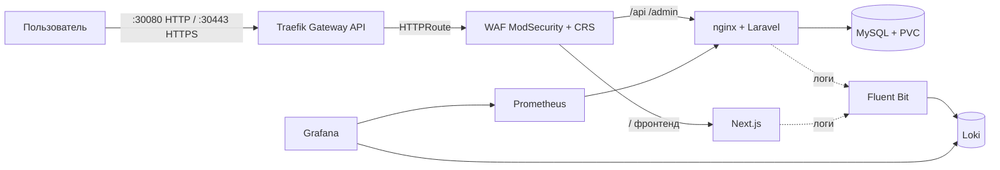

# Паспорт решения — `full_proj`

> Паспорт для быстрого скрининга экспертами (структура по заданию: 3 страницы).
> Подробная документация и спецификации — в репозитории ([`docs/`](README.md)).

---

## Страница 1. Архитектура и состав решения

| Параметр | Значение |
|---|---|
| Версия Kubernetes | **k3s v1.36.5 (Kubernetes v1.36.5)**, containerd 2.3.4 |
| Способ развёртывания K8s | k3s (`get.k3s.io`), всё приложение — Helm-чарты, одна команда `./scripts/deploy.sh` |
| Реализация Gateway API | **Traefik v3.7.13** (Gateway API v1.5.1): GatewayClass `traefik`, Gateway `full-proj-gateway` (listeners HTTP :80 + HTTPS :443, PROGRAMMED), HTTPRoute `full-proj-route` |
| Внешний доступ | HTTP `http://<node-ip>:30080`, HTTPS `https://<node-ip>:30443` (самоподписанный TLS, terminate на Gateway) |
| Инструменты автоматизации | `scripts/build-images.sh`, `scripts/deploy.sh`, `scripts/gen-cert.sh`, Helm, GitHub Actions (CI + CD) |
| Логирование | **Fluent Bit v5.1.3 (DaemonSet) → Loki v3.6.12** (filesystem + PVC) |
| Мониторинг | **Prometheus v3.15** + node-exporter + kube-state-metrics + nginx-exporter приложения |
| Визуализация | **Grafana v12.3.1** (NodePort 30300): 3 готовых дашборда (железо, k8s/приложение, WAF-логи), Prometheus + Loki подключены автоматически |
| ОС тестирования | Ubuntu 24.04.5 LTS |
| Доп. улучшения | **WAF ModSecurity + OWASP CRS** (✅ в k8s и Compose), метрики приложения (✅), Grafana (✅), HTTPS/самоподписанный TLS (✅), безопасность секретов (✅) |

### Архитектурная схема



---

## 🚀 Запуск (для проверяющего)

Инструкция — в [README](../readme.md), раздел «Быстрый старт». Минимальный путь:

```bash
# 0. Кластер k3s (один раз; Ubuntu 24.04)
curl -sfL https://get.k3s.io | sh -s - --disable traefik --disable metrics-server
sudo cat /etc/rancher/k3s/k3s.yaml > ~/.kube/config && chmod 600 ~/.kube/config

# 1. Образы приложения в локальный registry
./scripts/build-images.sh

# 2. Секреты (из шаблона)
cp local-secrets.example.yaml local-secrets.yaml   # заполнить APP_KEY и пароли

# 3. Развернуть ВСЁ одной командой:
#    Gateway API (HTTP+HTTPS) → WAF → приложение, Prometheus, Grafana, Loki+Fluent Bit
./scripts/deploy.sh
```

Точки входа после развёртывания:

| Сервис | URL | Доступ |
|---|---|---|
| Приложение (фронтенд) | `https://<node-ip>:30443/` | открытый; `http://<node-ip>:30080/` → 302-редирект на HTTPS |
| Приложение (HTTPS, самоподписанный TLS) | `https://<node-ip>:30443/` | предупреждение браузера о CA — ожидаемо |
| Админ-панель Filament | `https://<node-ip>:30443/admin` | пользователь создаётся в CMS |
| API | `https://<node-ip>:30443/api` | JSON |
| Grafana | `http://<node-ip>:30300` | `admin` / `GRAFANA_ADMIN_PASSWORD` (по умолчанию `admin`) |
| Prometheus | `kubectl port-forward -n monitoring svc/prometheus-server 9090:80` | `http://localhost:9090` |
| Loki | `kubectl port-forward -n logging svc/loki 3100:3100` | `http://localhost:3100` |

> Примечание для ноутбука с нестабильным Wi-Fi: зафиксируйте адрес ноды
> `--node-ip` на dummy-интерфейсе (SPEC-01, Примечание 3) — иначе смена
> сети потребует `sudo systemctl restart k3s`.

---

## Страница 2. Реализованный функционал

### Обязательная часть

| Требование кейса | Как реализовано | Обоснование | Как проверить |
|---|---|---|---|
| Веб-приложение в Kubernetes | Deployments backend(+nginx+exporter)/frontend/mysql, PVC, Secret `app-secrets`, миграции | стандартные ресурсы, минимальный стек | `kubectl get pods -n full-proj`; `curl localhost:30080/api/news` → 200 JSON |
| Доступ через Gateway API | Traefik v3: GatewayClass + Gateway (HTTP :80 → 302-редирект, HTTPS :443) + HTTPRoute → Service waf | open-source, без вендор-лока; Gateway API v1.5.1 | `kubectl get gateway -n full-proj` (PROGRAMMED=True); `curl -sk https://localhost:30443/api/news` → 200 |
| Prometheus собирает метрики | prometheus-чарт + node-exporter + kube-state-metrics + sidecar nginx-exporter (аннотации) | метрики и инфраструктуры, и приложения | `kubectl port-forward -n monitoring svc/prometheus-server 9090:80`; `curl localhost:9090/api/v1/query?query=up`; `nginx_http_requests_total` |
| Fluent Bit собирает логи | DaemonSet Fluent Bit (CRI-парсер) → Loki single-binary | лёгкий сборщик, централизованное хранилище | после `curl` к приложению: Loki API `{namespace="full-proj"}` содержит access-лог |
| Ubuntu 24.04 | весь стенд развёрнут на Ubuntu 24.04.5 LTS | требование кейса | воспроизведение по `deploy.sh` |
| Автоматизация | `deploy.sh` (5 шагов, Helm из OCI); повторный запуск идемпотентен | минимум команд, воспроизводимость | `./scripts/deploy.sh` повторно → «has been upgraded», без ошибок |

### Дополнительные улучшения

| Улучшение | Как реализовано | Обоснование | Как проверить |
|---|---|---|---|
| WAF в k8s | Deployment `waf` (ModSecurity+CRS) — **единая точка входа: фронтенд и бэкенд за WAF** (роутинг по path); правило 1000001 (сканеры/ботнеты), `limit_req` на статику (429); ConfigMap'ы в `helm/templates/waf.yaml` | защита прикладного уровня, обойти нельзя (внешних портов у приложений нет) | `./waf/tests/run-tests.sh http://localhost:30080` → **18/18**; `python3 waf/tests/ddos_static.py` → 429; `kubectl logs deploy/waf` → audit JSON с ruleId |
| Метрики приложения | nginx-prometheus-exporter sidecar (stub_status) | HTTP-метрики обязательны для observability | PromQL `nginx_http_requests_total` растёт после запросов |
| Безопасность секретов | env/Secret/CI-secrets; история очищена от утёкших секретов | требование кейса | SPEC-08: git grep по истории пусто |
| CI/CD | CI `.github/workflows/ci.yml` (авто на push/PR): helm lint + сборка + push в GHCR. CD `.github/workflows/deploy.yml` (workflow_dispatch): helm upgrade на self-hosted runner — выполняет принимающая сторона | финал — на завершающем этапе | push в main → CI зелёный, образы в GHCR |
| Grafana | чарт `infra/grafana/values.yaml`, NodePort 30300; Prometheus+Loki подключены автоматически; 3 дашборда из ConfigMap (железо, k8s/приложение, WAF-логи) | визуализация метрик и логов без ручной настройки | `http://<node-ip>:30300` → дашборды с данными |
| HTTPS (самоподписанный TLS) | listener `https` :443 в Gateway (`certificateRefs` → Secret `full-proj-tls` из `scripts/gen-cert.sh`); terminate на Traefik, WAF инспектирует расшифрованный трафик | безопасность без внешнего CA; фронтенд на относительных URL — работает и по HTTP, и по HTTPS | `curl -sk https://localhost:30443/api/news` → 200; атака на HTTPS → 403 |

---

## Страница 3. Ревью работы и потенциальное масштабирование

**Главная особенность решения.** Полный набор обязательных пунктов кейса в едином
контуре k3s: Gateway API (Traefik) как единственная точка входа, WAF ModSecurity
перед приложением, метрики приложения и узла в Prometheus, логи в Loki — всё
воспроизводится одной командой из чистого репозитория.

**Самое сложное решение.** Реализация частотного ограничения (L7-DDoS): коллекции
ModSecurity v3 не персистятся между запросами (проверено экспериментально), поэтому
правило сделано на nginx `limit_req` (ADR-4 в `waf/SPEC.md`); плюс отладка DNS k3s
v1.36.x (CoreDNS без env service host/port + конфликт CIDR сервисов с маршрутами VPN —
зафиксировано в SPEC-01).

**Предложения по дальнейшему развитию:**

1. kubeadm-кластер (приоритет кейса) + HA (≥3 узла, внешний etcd).
2. cert-manager (Let's Encrypt) вместо самоподписанного сертификата + HTTP→HTTPS redirect (самоподписанный TLS уже реализован ✅).
3. Расширенный Gateway API: маршрутизация по hostname, несколько бэкендов, traffic splitting.
4. Алерты в Grafana/Alertmanager (дашборды и визуализация уже реализованы ✅).
5. Security-контур: gitleaks в CI, sealed-secrets, NetworkPolicy, RBAC.
6. Телком-специфика: HPA по метрикам, геораспределённость, HA БД (репликация/бэкапы,
   S3-совместимое хранилище логов) — потребует внешней инфраструктуры оператора.
